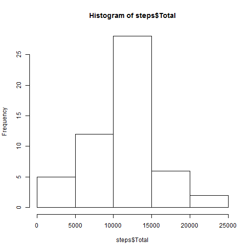
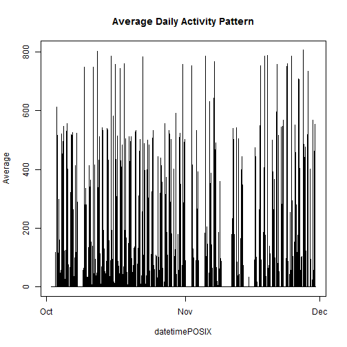
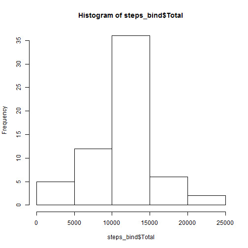
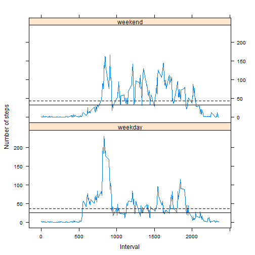

```r
Sys.setlocale("LC_TIME","English")
```

```
## [1] "English_United States.1252"
```

```r
time <- format(Sys.time(), "%F %T %Z")
tz   <- Sys.timezone()
```

The current time is **2015-03-14 03:39:26 BRT** in **America/Sao_Paulo**.


```r
library(lattice)
library(knitr)
library(dplyr)
```

## Loading and preprocessing the data


```r
if(!file.exists("activity.csv")){
        unzip("activity.zip", exdir = ".")
}
activity <- read.csv("activity.csv", header = T, sep = ',')
# Convert date from factor into a date object.
activity$datePOSIX <- as.POSIXct(activity$date, format = "%Y-%m-%d", tz = "GMT")
```

## What is mean total number of steps taken per day?


```r
by_day <- group_by(activity, datePOSIX)
steps <- na.omit(summarise(by_day, Total = sum(steps)))
hist(steps$Total)
```

 

```r
mean(steps$Total, na.rm = TRUE)
```

```
## [1] 10766.19
```

```r
median(steps$Total, na.rm = TRUE)
```

```
## [1] 10765
```

## What is the average daily activity pattern?


```r
activity$datetimePOSIX <- as.POSIXct(paste(activity$date, 
                                           sprintf("%04d", activity$interval)
                                           ),
                                     format="%Y-%m-%d %H%M", tz = "GMT")

by_datetime <- group_by(activity, datetimePOSIX)
steps_mean_dt <- na.omit(summarise(by_datetime, Average = mean(steps)))

plot(steps_mean_dt, type = "l", main = "Average Daily Activity Pattern")
```

 

```r
steps_mean_dt[ which.max(steps_mean_dt$Average), ]
```

```
## Source: local data frame [1 x 2]
## 
##         datetimePOSIX Average
## 1 2012-11-27 06:15:00     806
```

## Imputing missing values
The total of missing values can be computed with:


```r
totalNA <- sum(is.na(activity$steps))
```

The value is **2304**. The presence of missing may introduce
bias into some calculations or summaries of data.  
In order to fill these **2304** NA values, the rounded average steps (mean)
for that 5 minute interval were taken:


```r
IMP <- aggregate(steps ~ interval, data = activity, mean)
IMP$steps <- as.integer(round(IMP$steps))
```

A data set that is equal to the original dataset but with the missing data filled in were prepared:


```r
names(IMP)[2] <- "activityMean"
bind <- merge(activity, IMP)
```

Perform imputing.


```r
bind$steps[ is.na( bind$steps ) ] <- bind$activityMean[ is.na( bind$steps ) ]
bind$activityMean <- NULL
bind <- arrange(bind, datetimePOSIX)
bind <- bind[, names(activity)]
```

Data set **bind** is the data set **activity** but with the missing data filled in.


```r
str(activity)
```

```
## 'data.frame':	17568 obs. of  5 variables:
##  $ steps        : int  NA NA NA NA NA NA NA NA NA NA ...
##  $ date         : Factor w/ 61 levels "2012-10-01","2012-10-02",..: 1 1 1 1 1 1 1 1 1 1 ...
##  $ interval     : int  0 5 10 15 20 25 30 35 40 45 ...
##  $ datePOSIX    : POSIXct, format: "2012-10-01" "2012-10-01" ...
##  $ datetimePOSIX: POSIXct, format: "2012-10-01 00:00:00" "2012-10-01 00:05:00" ...
```

```r
str(bind)
```

```
## 'data.frame':	17568 obs. of  5 variables:
##  $ steps        : int  2 0 0 0 0 2 1 1 0 1 ...
##  $ date         : Factor w/ 61 levels "2012-10-01","2012-10-02",..: 1 1 1 1 1 1 1 1 1 1 ...
##  $ interval     : int  0 5 10 15 20 25 30 35 40 45 ...
##  $ datePOSIX    : POSIXct, format: "2012-10-01" "2012-10-01" ...
##  $ datetimePOSIX: POSIXct, format: "2012-10-01 00:00:00" "2012-10-01 00:05:00" ...
```

Make a histogram of the total number of steps taken each day and 
Calculate and report the mean and median total number of steps taken per day.


```r
by_day_bind <- group_by(bind, datePOSIX)
steps_bind <- summarise(by_day_bind, Total = sum(steps))
hist(steps_bind$Total)
```

 

```r
mean(steps_bind$Total)
```

```
## [1] 10765.64
```

```r
median(steps_bind$Total)
```

```
## [1] 10762
```

These values differ from the estimates from the first part of the assignment by:


```r
mean(steps$Total) - mean(steps_bind$Total)
```

```
## [1] 0.549335
```

```r
median(steps$Total) - median(steps_bind$Total)
```

```
## [1] 3
```

```r
paste0(round((1 - (mean(steps$Total) / mean(steps_bind$Total))) * 100, digits = 2),"%")
```

```
## [1] "-0.01%"
```

```r
paste0(round((1 - (median(steps$Total) / median(steps_bind$Total))) * 100, digits = 2),"%")
```

```
## [1] "-0.03%"
```

The impact of imputing missing data on the estimates of the total daily number
of steps increases precision decreasing the estimates, as shown above.
## Are there differences in activity patterns between weekdays and weekends?
By creating a new factor variable in the dataset with filled-in missing values with two levels – “weekday” and “weekend” indicating whether a given date is a weekday or weekend day will help.


```r
bind$weekday <- as.factor(ifelse(weekdays(activity$datePOSIX) 
                                 %in% c('Saturday', 'Sunday'), 'weekend', 'weekday'))
```

And with a panel plot containing a time series plot of the 5-minute interval (x-axis) and the average number of steps taken, averaged across all weekday days or weekend days (y-axis) we see:


```r
by_interval_bind <- group_by(bind, interval, weekday)
steps_by_interval_bind <- summarise(by_interval_bind, Average = mean(steps))

xyplot( Average ~ interval | weekday, data = steps_by_interval_bind, type = "l", layout = c(1,2),
        xlab = "Interval", ylab = "Number of steps", 
        panel = function (x, y, ...) {
                panel.xyplot(x, y, ...)
                panel.abline(h = mean(y), lty = 2) # lty = 2 (dashed line)
                panel.abline(h = median(y), lty = 1) # lty = 1 (solid line, default)
        }
)
```

 
